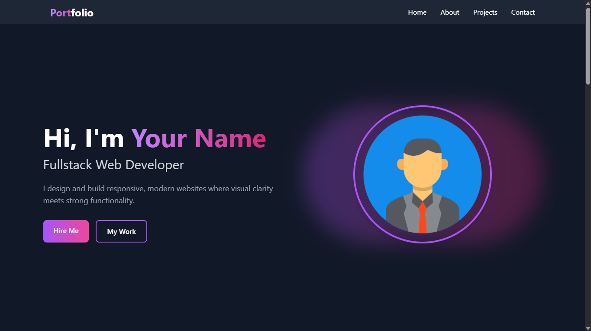

# 🚀 Portfolio Template - Modern & Responsive

<div align="center">


*Template portfolio elegan untuk menunjukkan karya terbaikmu!*

</div>

<div align="center">



*Tampilan utama portfolio - Design modern dan profesional*

</div>

## ✨ Fitur Unggulan

### 🎯 Design & UX
- ✅ **100% Responsive** - Tampilan sempurna di semua perangkat
- ✅ **Modern Interface** - Desain bersih dan profesional
- ✅ **Smooth Animations** - Transisi yang halus
- ✅ **User Friendly** - Navigasi yang intuitif

### ⚡ Functionality
- 📧 **Contact Form** - Form kontak yang functional
- 📊 **Skills Progress** - Progress bar skill yang animasi
- 📄 **CV Download** - Fitur download CV (tersedia di folder assets/cv)
- 🎯 **Smooth Scrolling** - Navigasi yang halus antar section

### 🛠️ Technical
- 🎨 **Pure CSS3** - Custom styling tanpa framework berat
- 📱 **Mobile First** - Pendekatan design modern
- 🚀 **Fast Loading** - Optimized performance
- ♿ **Accessibility** - Ramah untuk semua pengguna

## 🚀 Quick Start

### Prerequisites
- Web browser modern
- Text editor (VS Code recommended)
- Basic knowledge HTML/CSS

### Installation Steps

```bash
# 1. Clone repository
git clone https://github.com/Libra2694/Template-Portfolio-Modern.git

# 2. Masuk ke directory
cd Template-Portfolio-Modern

# 3. Buka di editor favorit
code .  # atau editor lain
```

### 🎯 Cara Menggunakan
1. **Download atau clone template**
2. **Edit konten** di file `index.html`
3. **Customize styling** di `assets/styles.css`
4. **Ganti gambar** di folder `assets/images/`
5. **Upload CV** ke folder `assets/cv/`
6. **Deploy** ke hosting pilihan

## 🎨 Customization Guide

### 🔧 Basic Customization
```html
<!-- Ganti di index.html -->
<div class="hero">
    <h1>Nama Lengkap Anda</h1>
    <p>Fullstack Web Developer</p> <!-- Sesuaikan dengan profesi -->
</div>
```

### 📝 Bagian yang Perlu Disesuaikan
| Section | Yang Perlu Diubah | File |
|---------|-------------------|------|
| **Hero** | Nama, jabatan, foto profil | `index.html` + `assets/images/profile.jpg` |
| **About** | Deskripsi diri, skills, CV | `index.html` + `assets/cv/masukincvpdfmu.pdf` |
| **Projects** | Gambar proyek, deskripsi, link | `index.html` + `assets/images/project.png` |
| **Contact** | Email, telepon, lokasi | `index.html` |

### 🎨 Custom Warna & Styling
```css
/* Edit di assets/styles.css */
:root {
    --primary-color: #2c3e50;    /* Warna utama */
    --accent-color: #3498db;     /* Warna aksen */
    --text-color: #333333;       /* Warna teks */
    --background-color: #ffffff; /* Warna background */
}
```

## 📁 Struktur Proyek

```
Template-Portfolio-Modern/
│
├── 📄 index.html                 # File utama website
├── 📄 LICENSE                   # File lisensi MIT
├── 📄 README.md                 # Dokumentasi (file ini)
│
└───📁 assets/
    │
    ├── 🎨 styles.css            # Stylesheet custom
    ├── ⚡ script.js             # JavaScript functionality
    │
    ├───📁 cv/
    │   └── 📄 masukincvpdfmu.pdf  # File CV (ganti dengan CV-mu)
    │
    └───📁 images/
        ├── 🖼️ cv.png            # Icon CV
        ├── 🖼️ portfolio.png     # Screenshot portfolio
        ├── 🖼️ profile.jpg       # Foto profil
        └── 🖼️ project.png       # Gambar project
```

## 🛠️ Technologies Used

<div align="center">


</div>

## 🌐 Deployment

### Platform Recommended
- **Netlify** - Mudah drag & drop
- **Vercel** - Cocok untuk developer
- **GitHub Pages** - Hosting gratis
- **Firebase Hosting** - Platform Google

### Quick Deploy to Netlify
[](https://app.netlify.com/start/deploy?repository=https://github.com/Libra2694/Template-Portfolio-Modern)

### Deploy to GitHub Pages
1. Push code ke GitHub repository
2. Go to Settings → Pages
3. Select branch `main` dan folder `/ (root)`
4. Access website di `https://username.github.io/repository-name`

## 🤝 Contributing

Ingin berkontribusi? Silakan!
1. Fork project ini
2. Create feature branch (`git checkout -b feature/FiturBaru`)
3. Commit changes (`git commit -m 'Tambahkan fitur baru'`)
4. Push to branch (`git push origin feature/FiturBaru`)
5. Open Pull Request

## 📞 Support

**Butuh bantuan?** 
- 📧 Email: libraproject26@gmail.com
- 📱 WhatsApp: +84 56 318 5476
- 🐛 [Create Issue](https://github.com/Libra2694/Template-Portfolio-Modern/issues)
- 💬 Diskusi via GitHub Discussions

## 📄 License

Distributed under MIT License. Lihat file `LICENSE` untuk informasi lebih lanjut.

## 👨‍💻 Developer

**Your Name** - *Fullstack Developer*
- 🌐 Portfolio: [Libra](https://portfolio-alifaditya.wuaze.com/)
- 🐙 GitHub: [@Libra2694](https://github.com/Libra2694)

---

<div align="center">

### 🎯 Langkah Selanjutnya Setelah Download:

1. **Ganti semua placeholder text** di `index.html`
2. **Update informasi kontak** (email, telepon, lokasi)
3. **Upload foto profil** baru ke `assets/images/profile.jpg`
4. **Ganti file CV** di `assets/cv/` dengan CV-mu
5. **Update screenshot project** sesuai karya aslimu
6. **Test di localhost** sebelum deploy

### ⭐ Jangan lupa beri bintang jika template ini membantu!

**Dibuat dengan ❤️ untuk developer Indonesia**

[⬆ Back to top](#-portfolio-template---modern--responsive)

</div>

---
